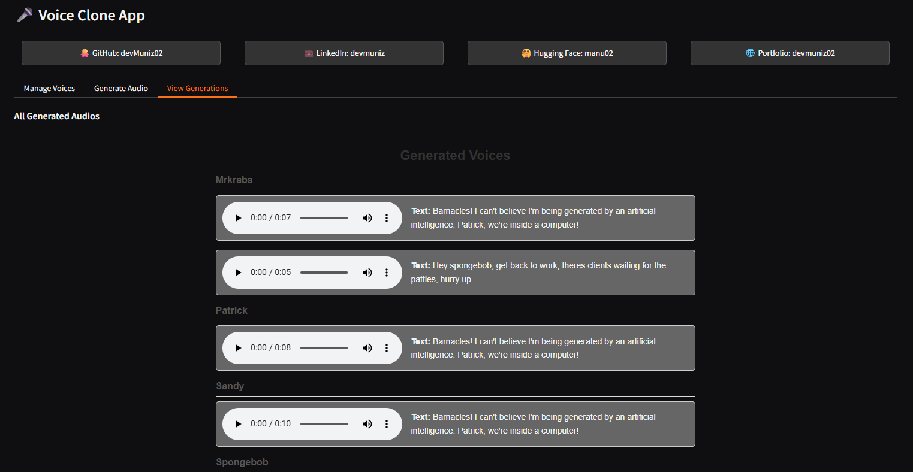

# Voicecloning

> This repository provides a seamless "all-in-one" solution to clone any voice found on YouTube. By simply providing a URL, the application extracts the audio, uses AI to transcribe the speaker's unique speech patterns, and allows you to generate new dialogue in that exact voice.

[](https://opensource.org/licenses/MIT)
[](https://github.com/devMuniz02/VoiceCloning/issues)
[](https://github.com/devMuniz02/VoiceCloning/stargazers)



## 📋 Table of Contents

- [Features](#features)
- [Installation](#installation)
- [Usage](#usage)
- [Project Structure](#project-structure)
- [Configuration](#configuration)
- [Contributing](#contributing)
- [License](#license)
- [Contact](#contact)

## ✨ Features

- **Voice Cloning from YouTube**: Extract audio from YouTube URLs and clone voices using AI
- **AI-Powered Transcription**: Automatically transcribe and analyze speech patterns
- **Character Voice Generation**: Generate new dialogue in cloned voices
- **SpongeBob Character Support**: Pre-configured for Mr. Krabs, Patrick, Sandy, and SpongeBob voices
- **Reference Text Management**: Organized reference texts for accurate voice cloning
- **Generation Output Storage**: Save and organize generated voice samples

## 🚀 Installation

### Prerequisites

- Python 3.8+
- Git
- CUDA-compatible GPU (recommended for faster processing)

### Installation Steps

```bash
# Clone the repository
git clone https://github.com/devMuniz02/VoiceCloning.git

# Navigate to the project directory
cd VoiceCloning

# Install dependencies
pip install -r requirements.txt
```

## 📖 Usage

### Running the Web Interface

```bash
# Run the Gradio web application
python app.py
```

This will start a local web server where you can:
- Input a YouTube URL to extract voice samples
- Generate new dialogue in cloned voices
- Choose from pre-configured SpongeBob characters

### Command-Line Voice Cloning

```bash
# Run the voice cloning script for a specific character
python clone.py
```

Modify `clone.py` to change the `VOICE_NAME` variable for different characters:
- spongebob
- mrkrabs
- sandy
- patrick

### Advanced Usage

The application uses:
- **Whisper**: For audio transcription and speech analysis
- **Qwen TTS**: For voice synthesis and cloning
- **yt-dlp**: For YouTube audio extraction
- **Gradio**: For the web interface

## 📁 Project Structure

```
VoiceCloning/
├── app.py                  # Main application script
├── clone.py                # Voice cloning functionality
├── LICENSE                 # License file
├── README.md               # Project documentation
├── requirements.txt        # Python dependencies
├── assets/                 # Static assets (images, icons, etc.)
├── data/                   # Data files and datasets
├── docs/                   # Documentation files
├── generations/            # Generated voice outputs
│   ├── mrkrabs/
│   │   ├── 1.txt
│   │   └── 2.txt
│   ├── patrick/
│   │   └── 1.txt
│   ├── sandy/
│   │   └── 1.txt
│   └── spongebob/
│       └── 1.txt
├── notebooks/              # Jupyter notebooks for analysis and prototyping
├── scripts/                # Utility scripts and automation tools
├── src/                    # Source code
├── tests/                  # Unit tests and test files
└── voices/                 # Voice reference data
    ├── mrkrabs/
    │   └── mrkrabs_reference_text.txt
    ├── patrick/
    │   └── patrick_reference_text.txt
    ├── sandy/
    │   └── sandy_reference_text.txt
    └── spongebob/
        └── spongebob_reference_text.txt
```

### Directory Descriptions

- **`app.py`**: Main application entry point for the voice cloning interface.
- **`clone.py`**: Core voice cloning logic and AI processing.
- **`assets/`**: Static files like images, icons, fonts, and other media assets.
- **`data/`**: Datasets, input files, and any data-related resources.
- **`docs/`**: Additional documentation, guides, and project-related files.
- **`generations/`**: Output directory containing generated voice samples for different characters.
- **`notebooks/`**: Jupyter notebooks for data exploration, prototyping, and demonstrations.
- **`scripts/`**: Utility scripts for automation, setup, deployment, or maintenance tasks.
- **`src/`**: Main source code for the project.
- **`tests/`**: Unit tests, integration tests, and test-related files.
- **`voices/`**: Reference voice data and text files for different characters.

## ⚙️ Configuration

The application can be configured by modifying the following in `clone.py`:
- `VOICE_NAME`: Choose from "spongebob", "mrkrabs", "sandy", "patrick"
- `SOURCES`: Dictionary containing YouTube URLs and time ranges for each character
- Model size in `app.py`: Choose between "0.6B" and "1.7B" models

Reference text files are stored in `voices/{character}/{character}_reference_text.txt` and can be customized for better voice cloning accuracy.

## 🤝 Contributing

Contributions are welcome! Please follow these steps:

1. Fork the repository
2. Create a feature branch (`git checkout -b feature/AmazingFeature`)
3. Commit your changes (`git commit -m 'Add some AmazingFeature'`)
4. Push to the branch (`git push origin feature/AmazingFeature`)
5. Open a Pull Request

### Development Setup

```bash
# Install development dependencies (if available)
pip install -r requirements.txt

# Run tests (if available)
python -m pytest tests/

# Code formatting
pip install black
black .
```

## 📄 License

This project is licensed under the MIT License - see the [LICENSE](LICENSE) file for details.

**Links:**
- **GitHub:** [https://github.com/devMuniz02/](https://github.com/devMuniz02/)
- **LinkedIn:** [https://www.linkedin.com/in/devmuniz](https://www.linkedin.com/in/devmuniz)
- **Hugging Face:** [https://huggingface.co/manu02](https://huggingface.co/manu02)
- **Portfolio:** [https://devmuniz02.github.io/](https://devmuniz02.github.io/)

Project Link: [https://github.com/devMuniz02/VoiceCloning](https://github.com/devMuniz02/VoiceCloning)

---

⭐ If you find this project helpful, please give it a star!
